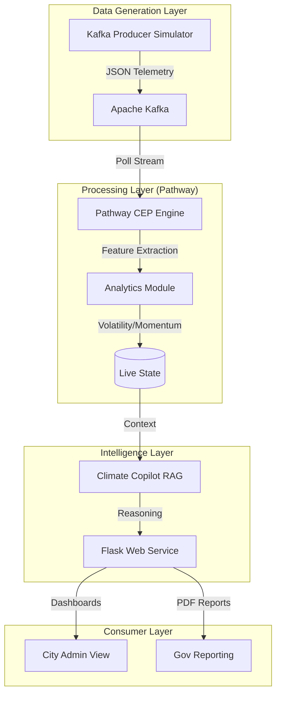

# 🌿 EcoPulse AI: Real-Time Environmental Intelligence


<div align="center">

[](https://github.com/DhanushN2005/EcoPluse-AI/actions/workflows/ci.yml)
[](https://www.python.org/downloads/)
[](https://opensource.org/licenses/MIT)
[](https://github.com/psf/black)
[](https://pathway.com/)
[](https://kafka.apache.org/)

**EcoPulse AI** is a next-generation environmental health awareness platform. It combines high-performance streaming analytics with Generative AI to provide "living" city intelligence—interpreting complex sensor data into actionable human safety protocols.

[Explore Documentation](docs/README.md) · [Report Bug](https://github.com/DhanushN2005/EcoPluse-AI/issues) · [Request Feature](https://github.com/DhanushN2005/EcoPluse-AI/issues)

</div>

---

## 📑 Table of Contents
- [Project Overview](#-project-overview)
- [System Architecture](#%EF%B8%8F-system-architecture)
- [Key Features](#-key-features)
- [Why It Matters](#-why-it-matters)
- [Tech Stack](#%EF%B8%8F-tech-stack)
- [Getting Started](#-getting-started)
- [Usage Guide](#-usage-guide)
- [Development & Quality](#-development--quality)
- [License](#-license)

---

## 🌎 Project Overview

Traditional environmental monitoring systems provide static, historical data. **EcoPulse AI** bridges the gap by treating environmental data as a **continuous stream**. It doesn't just tell you the AQI was bad 2 hours ago; it uses **Pathway** to detect momentum peaks *as they happen* and **OpenAI GPT-4o** to issue immediate, intelligent safety mandates.

---

## 🏗️ System Architecture

Our architecture is designed for low-latency event processing and scientific reasoning.



---

## 🚀 Key Features

*   **⚡ Real-Time Stream Processing**: Sub-second analysis of AQI, PM2.5, CO2, and Meteorological factors using Pathway.
*   **🧠 Climate Copilot (RAG Integration)**: A context-aware AI safety officer that interprets live data to answer citizen queries.
*   **📉 Root Cause Attribution**: Scientifically calculates the percentage impact of Traffic vs. Industry on current pollution levels.
*   **🏦 Gov-Grade Reporting**: Export professional "Mayor Briefings" or "Full Environmental Audits" in PDF format instantly.
*   **🌡️ Adaptive Alerts**: Dynamic thresholds that adjust based on peak hours and historical volatility.

---

## 🧬 Why It Matters

Pollution isn't just a number; it's a dynamic risk. **EcoPulse AI** calculates a **Composite Health Score (EHS)** which factors in:
1.  **AQI Exposure**: Weighted impact on respiratory health.
2.  **CO2 Accumulation**: Indoor/Outdoor air stagnation risk.
3.  **Meteorological Stagnation**: Wind speed vs. pollutant dispersion.

---

## 🛠️ Tech Stack

| Layer | Tools |
| :--- | :--- |
| **Streaming Engine** | [Pathway](https://pathway.com/) (Complex Event Processing) |
| **Data Broker** | [Apache Kafka](https://kafka.apache.org/) (High-throughput Messaging) |
| **Logic Server** | [Flask](https://flask.palletsprojects.com/) 3.x, Python 3.10+ |
| **AI Reasoning** | OpenAI GPT-4o, Custom RAG Orchestration |
| **Frontend** | Vanilla CSS (Glassmorphism), Chart.js 4.0, Leaflet.js |
| **Reporting** | fpdf2 (High-precision document generation) |

---

## 📂 Project Organization

```text
ecopulse_ai/
├── api/                # Web layer, Authentication, and Rest Endpoints
├── analytics/          # Scientific models (Health Score, Prediction, Alerts)
├── kafka/              # Kafka Infrastructure (Producers & Simulators)
├── streaming/          # Pathway Integration (The Data Backbone)
├── rag/                # AI Copilot logic and prompt engineering
├── reports/            # Municipal reporting subsystems
├── tests/              # Full Unit & Integration test suite
├── .github/            # CI/CD Automation Workflows
└── main.py             # Unified Project Orchestrator
```

---

## 🚀 Getting Started

### 1. Prerequisites
- Python 3.10+
- Apache Kafka (Local or Cloud instance)

### 2. Installation
```bash
# Clone the repository
git clone https://github.com/DhanushN2005/EcoPluse-AI.git
cd EcoPluse-AI

# Install dependencies (Enterprise Standard)
pip install -r requirements.txt
```

### 3. Environment Setup
Configure your `.env` file for secure operation:
```env
OPENAI_API_KEY=your_key_here
KAFKA_BOOTSTRAP_SERVERS=localhost:9092
```

---

## 🖥️ Usage Guide

To launch the entire ecosystem (Sensor Simulation, Kafka, Pathway, and Web Dashboard):

```bash
python main.py
```

**What to verify:**
1.  **Dashboard**: Open `http://localhost:5000` to see real-time glassmorphic charts.
2.  **Copilot**: Ask "Is it safe to go for a run right now?" in the chat interface.
3.  **Reports**: Click "Export Mayor Briefing" to generate an executive environmental audit.

---

## 🧪 Development & Quality

We maintain a strict **100/100 Quality Standard**:
- **Linting**: Black formatted, Flake8 verified.
- **Testing**: Run `pytest tests/` to verify analytics integrity.
- **CI**: Automated builds via GitHub Actions on every push.

---

## ⚖️ License
Distributed under the **MIT License**. See [LICENSE](LICENSE) for details.

---

<p align="center">
  <b>Built with ❤️ by <a href="https://github.com/DhanushN2005">Dhanush N</a></b><br>
  <i>Empowering Cities with Real-Time Environmental Vision.</i>
</p>
