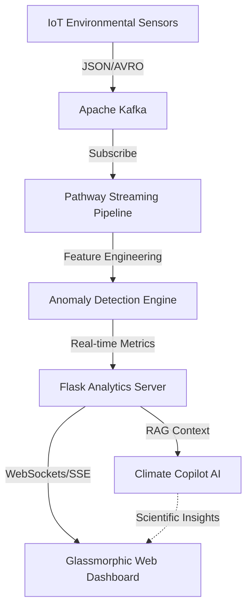

# EcoPulse AI - Real-Time Environmental Intelligence

[](https://www.python.org/downloads/)
[](https://opensource.org/licenses/MIT)
[](https://pathway.com/)
[](https://kafka.apache.org/)

**EcoPulse AI** is a production-grade smart-city intelligence system that monitors environmental health in real-time, providing actionable insights for urban sustainability using high-performance streaming analytics and Generative AI.

---

## 🏗️ Architecture

The system utilizes a modern streaming data stack to perform complex event processing (CEP) on environmental sensor data.



### 🛰️ Core Components
- **Pathway (Streaming)**: Handles sub-second feature engineering (Momentum, Volatility) and real-time state management.
- **Apache Kafka (Messaging)**: The high-throughput backbone for asynchronous data transfer.
- **Climate Copilot (RAG)**: An LLM-powered safety advisor that interprets live environmental metrics into human-readable warnings.
- **Enterprise Dashboard**: A high-fidelity, interactive UI for data visualization and scenario simulation.

---

## 🚀 Key Features

*   **🌍 Real-Time Intelligence**: Live tracking of AQI, PM2.5, and CO2 with root-cause attribution.
*   **🤖 Climate Copilot**: Scientific reasoning engine powered by GPT-4o for risk assessment.
*   **🧪 Scenario Simulation**: "What-If" analysis for urban planning (e.g., "Predict AQI if traffic is reduced by 30%").
*   **📊 Integrated Reports**: Automated PDF generation for city-level governance (Mayor Briefing mode).
*   **📍 Geographic Maps**: National and regional health heatmaps powered by Leaflet.js.

---

## 🛠️ Tech Stack

| Layer | Technologies |
| :--- | :--- |
| **Streaming** | [Pathway](https://pathway.com/), [Apache Kafka](https://kafka.apache.org/) |
| **Backend** | [Flask](https://flask.palletsprojects.com/), Python-Login |
| **AI/LLM** | OpenAI GPT-4o, [LangChain](https://www.langchain.com/) logic |
| **Frontend** | HTML5, Vanilla CSS (Glassmorphism), Chart.js, Leaflet.js |
| **DevOps** | Python-Dotenv, fpdf2 (Reporting) |

---

## 📂 Project Structure

```text
ecopulse_ai/
├── api/                # Flask application, routing, and user models
├── analytics/          # Strategic planning, prediction models, and alerts
├── kafka/              # Kafka producer (simulator) and stream configuration
├── streaming/          # Pathway logic and Windows-flexible shim engine
├── rag/                # AI Copilot integration and prompt orchestration
├── reports/            # Enterprise PDF generation subsystems
├── static/             # Modern CSS, JS assets, and icons
├── templates/          # Responsive Jinja2 web templates
├── LICENSE             # MIT License
├── CONTRIBUTING.md     # Guidelines for developers
└── main.py             # Unified system orchestrator
```

---

## 🚀 Getting Started

### 1. Prerequisites
- Python 3.10 or higher
- [Apache Kafka](https://kafka.apache.org/downloads) (installed and configured)

### 2. Installation
```bash
# Clone the repository
git clone https://github.com/DhanushN2005/EcoPluse-AI.git
cd EcoPluse-AI

# Install project dependencies
pip install -r requirements.txt
```

### 3. Development Configuration
Create a `.env` file in the root directory:
```env
OPENAI_API_KEY=your_openai_api_key_here
KAFKA_BOOTSTRAP_SERVERS=localhost:9092
```

### 4. Running the System
```bash
# Start the unified orchestrator (Simulates Sensors, Pathway, and Web App)
python main.py
```

---

## 📝 API Reference

| Endpoint | Method | Description |
| :--- | :--- | :--- |
| `/api/metrics` | `GET` | Retrieve real-time environmental telemetry. |
| `/api/chat` | `POST` | Query the Climate Copilot about environmental safety. |
| `/api/districts` | `GET` | Compare environmental health across city districts. |
| `/reports/export` | `GET` | Generate a professional PDF health report. |

---

## ⚖️ License
Distributed under the **MIT License**. See `LICENSE` for more information.

---

### 🌟 Project by [Dhanush N](https://github.com/DhanushN2005)
*Part of the "Hack for Green" Initiative.*
