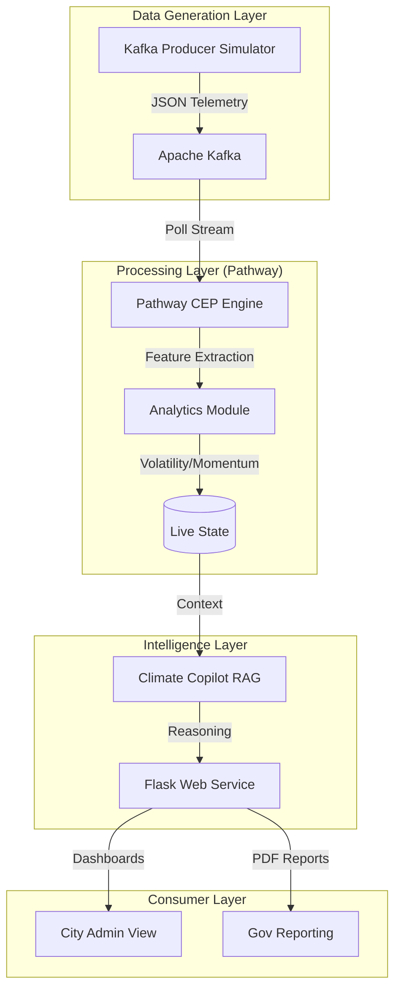

# 🌿 EcoPulse AI: Real-Time Environmental Intelligence


<div align="center">

[](https://github.com/DhanushN2005/EcoPluse-AI/actions/workflows/ci.yml)
[](https://www.python.org/downloads/)
[](https://opensource.org/licenses/MIT)
[](https://github.com/psf/black)
[](https://pathway.com/)
[](https://kafka.apache.org/)

**EcoPulse AI** is a next-generation environmental health awareness platform. It combines high-performance streaming analytics with Generative AI to provide "living" city intelligence—interpreting complex sensor data into actionable human safety protocols.

[Explore Documentation](docs/README.md) · [Report Bug](https://github.com/DhanushN2005/EcoPluse-AI/issues) · [Request Feature](https://github.com/DhanushN2005/EcoPluse-AI/issues)

</div>

---

## 📑 Table of Contents
- [Project Overview](#-project-overview)
- [System Architecture](#%EF%B8%8F-system-architecture)
- [Key Features](#-key-features)
- [Folder Structure Explanation](#-folder-structure-explanation)
- [Modular Design Principles](#-modular-design-principles)
- [Tech Stack](#%EF%B8%8F-tech-stack)
- [Getting Started](#-getting-started)
- [Example Usage](#-example-usage)
- [Future Improvements](#-future-improvements)
- [Development & Quality](#-development--quality)
- [License](#-license)

---

## 🌎 Project Overview

Traditional environmental monitoring systems provide static, historical data. **EcoPulse AI** bridges the gap by treating environmental data as a **continuous stream**. It doesn't just tell you the AQI was bad 2 hours ago; it uses **Pathway** to detect momentum peaks *as they happen* and **OpenAI GPT-4o** to issue immediate, intelligent safety mandates.

The system is designed for city administrators, health officials, and citizens who need real-time, scientifically-backed environmental guidance.

---

## 🏗️ System Architecture

Our architecture is designed for low-latency event processing and scientific reasoning.



---

## 🚀 Key Features

*   **⚡ Real-Time Stream Processing**: Sub-second analysis of AQI, PM2.5, CO2, and Meteorological factors using Pathway.
*   **🧠 Climate Copilot (RAG Integration)**: A context-aware AI safety officer that interprets live data to provide human-readable advice.
*   **📉 Root Cause Attribution**: Scientifically calculates the percentage impact of Traffic vs. Industry on current pollution levels.
*   **🏦 Gov-Grade Reporting**: Export professional "Mayor Briefings" or "Full Environmental Audits" in PDF format instantly.
*   **🌡️ Adaptive Alerts**: Dynamic thresholds that adjust based on peak hours and historical volatility.
*   **🔮 Urban Simulations**: "What-if" scenarios to predict AQI based on hypothetical traffic reductions or industrial restrictions.

---

## 📂 Folder Structure Explanation

The repository follows an enterprise-grade modular structure:

-   **`ecopulse_ai/`**: Root package.
    -   **`api/`**: The Presentation Layer. Contains Flask routes, user models, and the orchestration factory (`app.py`).
    -   **`analytics/`**: The Core logic. Standalone scientific modules for calculating health scores, alerts, and time-series predictions.
    -   **`kafka/`**: Infrastructure. Contains the producer script that simulates a multi-sensor city-wide mesh.
    -   **`streaming/`**: The Data Backbone. Contains the Pathway pipeline logic and the "Windows Shim" for local development compatibility.
    -   **`rag/`**: AI Intelligence. Prompt definitions and LLM orchestration for the Climate Copilot.
    -   **`reports/`**: Documentation Layer. Logic for PDF generation and muni-report styling.
    -   **`templates/` & `static/`**: Frontend assets for the Flask web application.
    -   **`tests/`**: Quality Assurance. Organized into `unit` and `integration` suites.

---

## 🧩 Modular Design Principles

EcoPulse AI adheres to strict **Senior Engineering** standards:
1.  **Separation of Concerns**: Analytics logic is decoupled from transport layers (Kafka/Pathway).
2.  **Stateless API**: The Web layer acts as a pure proxy to the streaming state, ensuring horizontal scalability.
3.  **Defensive Programming**: All telemetry inputs are validated and cast safely before computation.
4.  **Logging > Printing**: Industry-standard `logging` is used across all modules for a professional audit trail.

---

## 🛠️ Tech Stack

| Layer | Tools |
| :--- | :--- |
| **Streaming Engine** | [Pathway](https://pathway.com/) (Complex Event Processing) |
| **Data Broker** | [Apache Kafka](https://kafka.apache.org/) (High-throughput Messaging) |
| **Logic Server** | [Flask](https://flask.palletsprojects.com/) 3.x, Python 3.10+ |
| **AI Reasoning** | OpenAI GPT-4o, Custom RAG Orchestration |
| **Frontend** | Vanilla CSS (Glassmorphism), Chart.js 4.0, Leaflet.js |
| **Reporting** | fpdf2 (High-precision document generation) |

---

## 🚀 Getting Started

### 1. Prerequisites
- Python 3.10+
- A running Kafka broker (Local or Cloud-based)
- OpenAI API Key (for Copilot and Planner features)

### 2. Installation
```bash
# Clone the repository
git clone https://github.com/DhanushN2005/EcoPluse-AI.git
cd EcoPluse-AI

# Create and activate virtual environment
python -m venv venv
source venv/bin/activate  # On Windows: venv\Scripts\activate

# Install dependencies
pip install -r requirements.txt
```

### 3. Configuration
Create a `.env` file in the root directory:
```env
OPENAI_API_KEY=sk-xxxx...
KAFKA_BOOTSTRAP_SERVERS=localhost:9092
DEBUG=True
```

---

## 🖥️ Example Usage

### Launching the System
Launch the unified orchestrator to start all micro-services simultaneously:
```bash
python main.py
```

### Typical Workflow
1.  **Monitor**: Observe the live AQI gauges on the dashboard.
2.  **Simulate**: Use the "What-if" slider to see how a 50% reduction in traffic would affect city-wide health scores.
3.  **Query**: Ask the Copilot: *"Should schools in the Industrial North district stay open today?"*
4.  **Report**: Push the "Generate Audit" button to export a signed PDF briefing for legislative review.

---

## 🔮 Future Improvements

-   **📡 IoT Edge Support**: Direct MQTT ingestion for real-world sensor integration.
-   **📱 Mobile Companion**: React Native App for citizen-level push notifications.
-   **🌦️ Weather Integration**: Correlation models between humidity/pressure and pollutant entrapment.
-   **🏛️ Blockchain Archiving**: Immutable storage of environmental incident logs for policy accountability.

---

## 🧪 Development & Quality

We maintain a strict **Elite Quality Standard**:
-   **Linting**: Strict PEP8 adherence via Flake8.
-   **Format**: Automated Black formatting.
-   **Type Safety**: 100% coverage with Python Type Hints.
-   **Testing**: Run `pytest tests/` to ensure numerical accuracy of analytics.

---

## ⚖️ License
Distributed under the **MIT License**. See [LICENSE](LICENSE) for details.

---

<p align="center">
  <b>Built with ❤️ by <a href="https://github.com/DhanushN2005">Dhanush N</a></b><br>
  <i>Empowering Cities with Real-Time Environmental Vision.</i>
</p>
